## Событиыйный плагин v1.0

### Установка

- в админку загрузить зип-архив eventplugin.zip

- результат нажатия кнопки "Установить" будет такой:
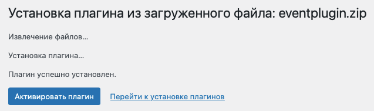

- далее можно перейти на подпункт "Плагины->Установленные" и нажать "Активирвать": 
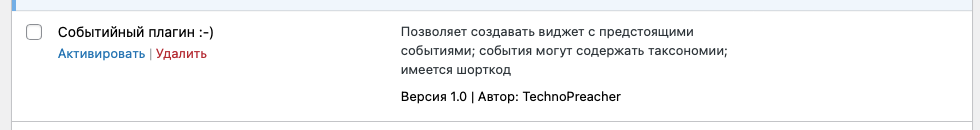

После этого плагин станет активным, и в боковом меню появится пункт "События :-)":
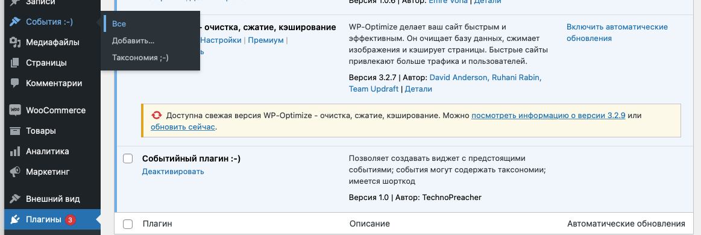

### Добавление события:

- нажав "События :-) -> Добавить" попадаем в добавление где выведен блок с кастомными полями
типа события и его даты:
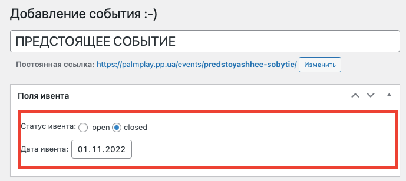

после публикации все данные сохраняются и корректно отображаются в открытом редакторе.
Ну а в общем списке ""События :-) -> Все" будут видны добавленные события причём с цветовой маркировкой статуса:
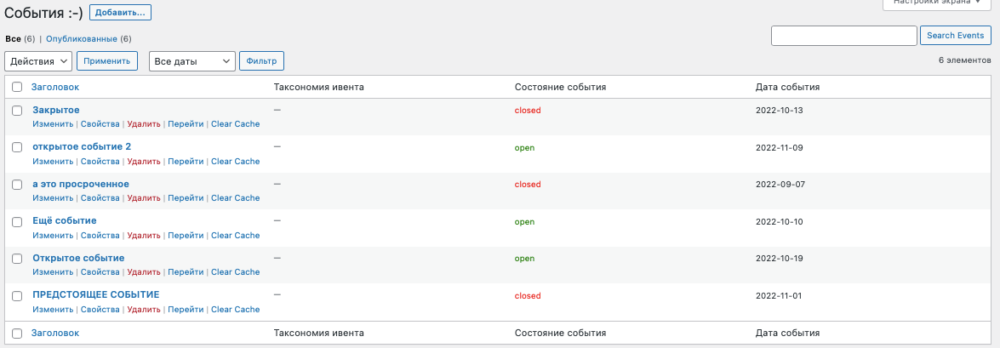

### Таксономия:

- добавляется через свой пункт в меню:
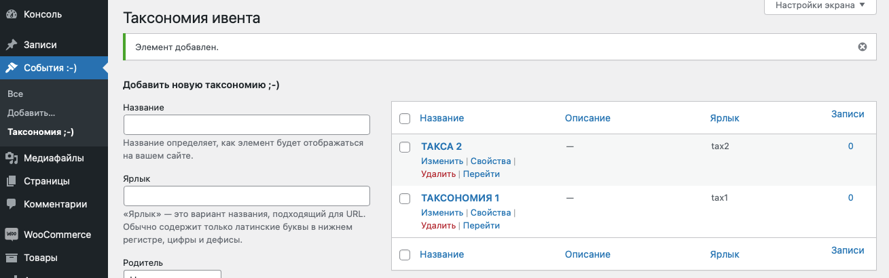

Ну и при присвоении событиям всё видно:
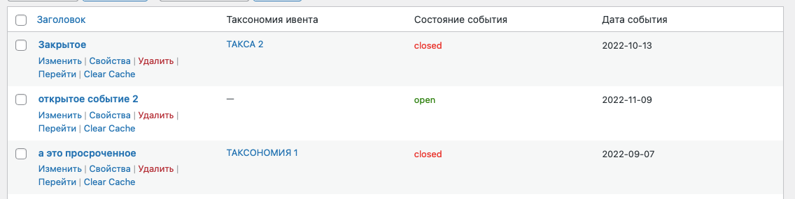

### Виджет:

Перейдя в меню "Внешний вид - виджеты" можно добавить наш виджет:
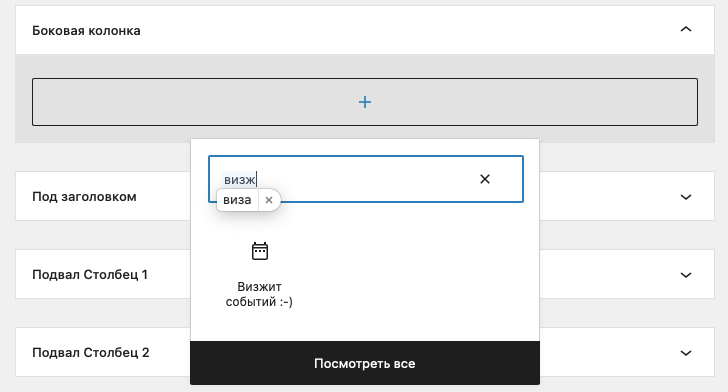

который по умолчанию будет выводить одно события открытого типа:
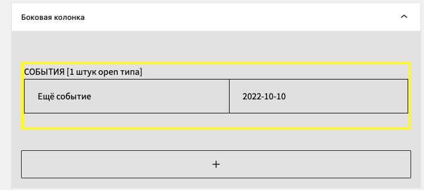

щёлкнув по нему можно настроить параметры виджета:
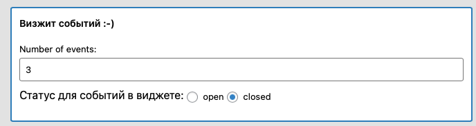

ну и после обновления он сразу отобразится:
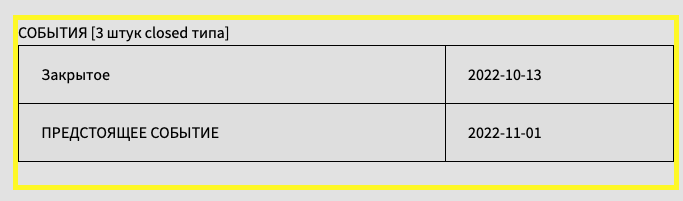

на странице https://palmplay.pp.ua/shop/ будет выглядеть так (за вёрстку не пинайте):
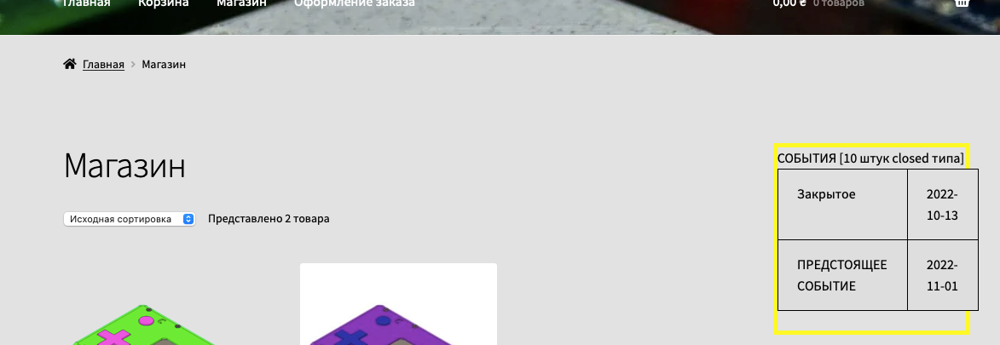

при этом просроченное (прошедшие событие отображаться не будет!)

### Шорткод:

Формат шоркода: [events numbers=4 status=closed] 

Ну и результат использования на странице https://palmplay.pp.ua/shop/ :
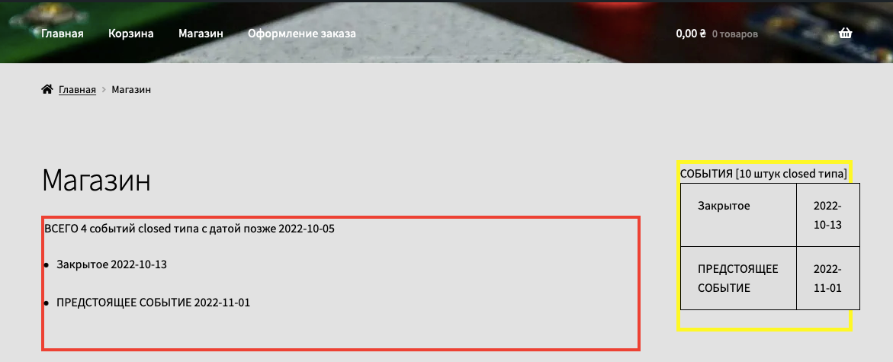

### Деактивация плагина:

Если его деактивировать результат на странице https://palmplay.pp.ua/shop/ будет унылым:
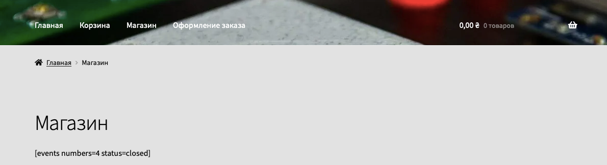

### Код:

Собственно код есть ещё куда вылизывать, причёсывать и оформлять:
- поправить вёрстку, 
- разрезать на несколько файлов (вынести расширенный класс в свой файл), 
- обеспечить переиспользование кода (к примеру массивов параметров в циклал WP),
- чистить БД после деактивации/удаления плагина
- ...
